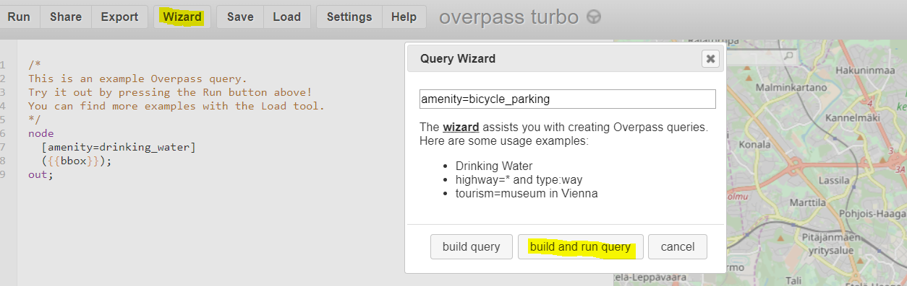

# Vektoritiilet: näin pääset alkuun!

This guide is in Finnish, because it is part of an article written in Finnish. Documentation in English can be found from [OpenMapTiles](https://openmaptiles.org/docs/) and [Mapbox](https://www.mapbox.com/help/tutorials/) websites.
Tämä ohje on suomeksi, koska sen on tarkoitus olla osa suomenkielistä artikkelia [Skrolli-lehdessä](https://skrolli.fi/numerot/2018-3/). Englanninkielisiä ohjeita löytyy mm. [OpenMapTilesin](https://openmaptiles.org/docs/) ja [Mapboxin](https://www.mapbox.com/help/tutorials/) sivuilta.

Lisää teoriaa löytyy kandidaatintutkielmastani: [Vektoritiilet](http://aulis.sange.fi/~varpushaukka/vektoritiilet.pdf)

Tämän ohjeen avulla haet OpenStreetMapista aineistoa, joista luot vektoritiiliaineiston ja teet mieleisesi tyylin. Suosittelen käyttämään jotain muuta kuin Windows-konetta.

Jos löydät tästä ohjeesta joitain virheitä, tai haluat jatkokehittää tätä, voit luoda issuen, tai forkata ja tehdä pull requestin.

## 1 OSM dataa vektoritiiliksi
Ensimmäisenä tarvitsemme paikkatietoa. [OpenStreetMapista](https://www.openstreetmap.org/#map=18/60.16940/24.93331) löytyy todella paljon aineistoa, jota ei löydy esim Googlen kartoista. Esimerkiksi OSM:stä löytyy tieto siitä missä on pyöräparkkeja. Haetaan siis [overpassin](http://overpass-turbo.eu/) avulla kaikki Helsingin pyöräparkit. 

### 1.1 Hae [overpass-turbo työkalulla](http://overpass-turbo.eu/) dataa GeoJSONina

 - Zoomaa sille alueelle josta haluat dataa
 - Valitse ylävalikosta wizard ja kirjoita kenttään `amenity=bicycle_parking` ja klikkaa build and run query.
 - Valitse ylävalikosta export ja download as GeoJSON
 - Voit ladata myös muita tasoja karttaasi, esimerkiksi baarit: `amenity=bar` tai leikkipaikat `leisure=playground`. Voit myös itse tutkia OpenSreetMapia ja keksiä mitä aineistoa haluaisit käyttää. Overpass-turbo ei ole hyvä työkalu isojen aineistojen hakemiseen. Jos haluat hakea esimerkiksi kaikki Helsingin tiet, tutustu [Overpass-API:iin](https://wiki.openstreetmap.org/wiki/Overpass_API) (vaatii ohjelmointitaitoa).
 
 
 
 ### 1.2 Luo vektoritiiliä GeoJSONista
Helpoin tapa esittää GeoJSONia selaimessa on käyttää kartanpiirtokirjastoa, kuten Leafletia tai Openlayersia. Nyt haluamme kuitenkin tehdä nimenomaan vektoritiiliä. Tähän on olemassa mm. Mapboxin kehittämiä työkaluja. Mapbox tarjoaa kirjaston, [geojson-vt](https://github.com/mapbox/geojson-vt), joka pilkkoo GeoJSONia vektoritiiliksi lennossa. Toinen hyödyllinen työkalu on myös Mapboxin tippecanoe, joka generoi mbtiles-tiilikokoelmia GeoJSONista. 

Asenna tippecanoe [näillä](https://github.com/mapbox/tippecanoe#installation) ohjeilla.

Tippecanoen asentamisen jälkeen siirry komentorivillä hakemistoon, johon tallensit GeoJSONin ja luo tiilet komennolla: 

`tippecanoe -o ppparkki.mbtiles export.geojson`

ppparkki.mbtiles on tiedosto, johon haluan lopputuloksen tulevan. Sen nimi voi olla mitä vain. export.geojson on overpassista lataamani aineisto. Jos kaikki meni hyvin, samaan kansioon pitäisi olla generoitunut ppparkki.mbtiles -niminen tiedosto.

Jos generoit enemmän kuin yhden GeoJSONin, voit vain laittaa tiedostot peräkkäin tähän tapaan:

`tippecanoe -o baaripyora.mbtiles ppparkki.geojson baarit.geojson`

jolloin GeoJSONit tulevat mbtiles-tiedostoon erillisinä tasoina.

## 2. Käynnistä vektoritiilipalvelin
Nyt haluamme tarkastella mbtiles-tiedoston sisältöä selaimessa. Jos sinulla sattuu olemaan docker asennettuna, helpointa on ajaa .mbtiles-tiedoston sisältävässä hakemistossa komento:

`docker run -it -v $(pwd):/data -p 8080:80 klokantech/tileserver-gl`

Dockerin käynnistämisen jälkeen avaa [localhost:8080](http://localhost:8080) ja valitse inspect. Kannattaa kokeilla väännellä karttaa hiiren oikealla painikkeella, koska se on todella tyydyttävää. Jee, vektoritiiliä!

Jos et halua käyttää dockeria, voit kokeilla jotain [näistä](https://github.com/mapbox/awesome-vector-tiles#servers).

## 3. Luo vektoritiilillesi tyyli
Vektoritiilityyli määritellään piirtäjäkirjaston vaatimalla syntaksilla. Esimerkiksi mapbox-gl -javascriptkirjasto syö json-muotoisen tyylimäärittelyn, jonka dokumentaatiota voi lukea mapbox-gl:n [dokumentaatiosivuilta](https://www.mapbox.com/mapbox-gl-js/style-spec).

Voit kirjoittaa tyylillesi suoraan raakaa jsonia, tai editoida sitä visuaalisella työkalulla, kuten [maputinikilla](https://maputnik.github.io/editor/).
 
## 4. Tee pieni sovellus
Kloonaa tämä repo, tai ota mallia tämän repon index.jsonista ja server.js:stä.

Jos kloonaat, aja ensin

`npm install`

ja sitten

`npm start`

## 4. Taustakartta OpenMapTilesin vektoritiilillä
Voit hakea tietyltä alueelta aineistot PostgreSQL-tietokantaan ja Mapboxin tai OpenMaptilesin työkaluilla luoda niistä vektoritiiliä, jonka jälkeen sinun pitää asentaa ja käynnistää vektoritiilipalvelin, josta tiilet haetaan. Jos et halua itse ylläpitää palvelinta, voit käyttää Mapboxin tai OpenMapTilesin tarjoilemia valmiita vektoritiilisettejä OpenStreetMap-aineistoille.

